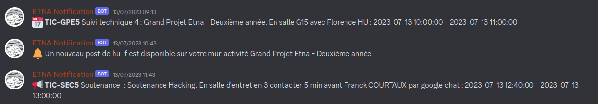

## ETNA Notification

Retrieve and send new notification from ETNA School Intranet to Discord Channel (bot).

This application could manage multiples users with their own discord private channel to
receive their notifications.

Note : this bot was made to be run on a single discord server. Channels defined is the .env configuration are server dependant.

## Getting Started

### Prerequisites

* Docker and docker-compose
* Discord account
* Discord Bot [Create a discord bot](https://github.com/Fimeo/ETNA-Notification/blob/main/doc/CreateDiscordBot.md)
* Preconfigured server with the discord bot [Preconfigure server](https://github.com/Fimeo/ETNA-Notification/blob/main/doc/PreconfigureServer.md)

### How to run

Copy and paste `.env.example` and fill it. All keys are mandatory.

If you need rsa keys, you can run `go run cmd/cli/rsa/main.go` command that generates public and private keys in the  `.ssh` folder.

Run project with docker-compose : `docker-compose up -d`

On the first launch, the database could be not ready at all when the app was launched.
Wait the postgres database server to be ready (see logs with `docker-compose logs -f postgres`) and then
restart migration : `docker-compose restart migrate`.

On the application startup, a websocket connection is created between the DiscordBot and DiscordServer.

The workflow is :
- The new ETNA student wants to receive their notifications on discord
- First step is to register his etna account of a web page https://github.com/Fimeo/ETNA-Notification-Front and make the register step or using the api [Swagger](https://github.com/Fimeo/ETNA-Notification/blob/main/api/swagger.json)
  - Invitation link is created to join the notification server
  - The account is created in the application
  - The ETNA student join the server by the invitation link and use the `/connect` slash command
- The slash command check the discord username and match the register one, a personal channel is created to receive their notifications.

If the ETNA account password has changed, notifications retrieving cannot be performed. To renew the password, make the register step again.
Idem if you want to change the linked discord account.

Channels in the configuration defined :
- `NOTIFICATION_CATEGORY_ID` : the category under personal channels are created
- `SYSTEM_ERROR_CHANNEL` : the admin channel error to receive bot errors
- `CONNECT_CHANNEL` : connect channel where invitation are for and where user made the slash commands.

Notifications are retrieved for all registered users with a valid DiscordAccount linked every 30 minutes.
Notifications are send only one time for each user on his dedicated channel.
Only the last 50 notifications are send.

Still to do on this project :
- Handle the case to add the bot on multiple servers (remove configuration channels)

### Note :

ETNA account information are stored in PostgresDatabase, but we need to extract password in clear version without encryption because
the etna school api has one day token validity. So password are rsa encrypted to be reversed only during application lifecycle.

Thanks to :
- [DiscordGo](https://github.com/bwmarrin/discordgo)
- [Gorm](https://github.com/go-gorm/gorm)
