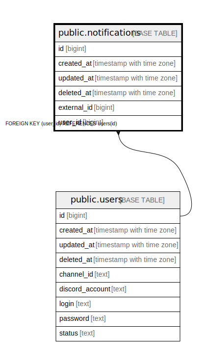

# public.notifications

## Description

## Columns

| Name | Type | Default | Nullable | Children | Parents | Comment |
| ---- | ---- | ------- | -------- | -------- | ------- | ------- |
| id | bigint | nextval('notifications_id_seq'::regclass) | false |  |  |  |
| created_at | timestamp with time zone |  | true |  |  |  |
| updated_at | timestamp with time zone |  | true |  |  |  |
| deleted_at | timestamp with time zone |  | true |  |  |  |
| external_id | bigint |  | true |  |  |  |
| user_id | bigint |  | true |  | [public.users](public.users.md) |  |

## Constraints

| Name | Type | Definition |
| ---- | ---- | ---------- |
| fk_notifications_user | FOREIGN KEY | FOREIGN KEY (user_id) REFERENCES users(id) |
| notifications_pkey | PRIMARY KEY | PRIMARY KEY (id) |

## Indexes

| Name | Definition |
| ---- | ---------- |
| notifications_pkey | CREATE UNIQUE INDEX notifications_pkey ON public.notifications USING btree (id) |
| idx_notifications_deleted_at | CREATE INDEX idx_notifications_deleted_at ON public.notifications USING btree (deleted_at) |
| idx_notification_external_id | CREATE INDEX idx_notification_external_id ON public.notifications USING btree (external_id) |

## Relations

---

> Generated by [tbls](https://github.com/k1LoW/tbls)
